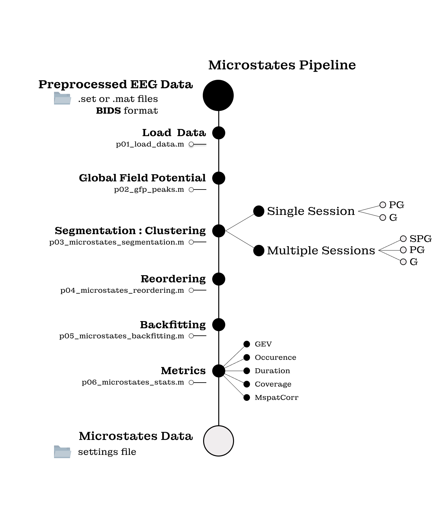

# EEGMicrostates :brain:
**Multiple levels Microstates Analysis for EEG data** 

Adapted from Christian Pfeiffer ([repository](https://github.com/cp3fr/Resting-State-EEG-Features)) and Moritz Truninger

## :toolbox: Requirements

- [ ] **Matlab** (>= 2019a)
    - [ ] Signal Processing Toolbox (signal)
    - [ ] Statistics and Machine Learning Toolbox (stats)
    - [ ] custom colormap (is located in [```external_files```](external_files))
- [ ] **eeglab** (latest) [github](https://github.com/sccn/eeglab)
    - [ ] Microstates Analysis Toolbox : Microstates1.2 (Thomas Koenig) [download](https://www.thomaskoenig.ch/Download/EEGLAB_Microstates/Microstates1.2.zip)
    - [ ] Microstates EEGlab Toolbox : MST1.0 (Poulsen et al., 2018) [github](https://github.com/atpoulsen/Microstate-EEGlab-toolbox)
## :jigsaw: Description

The multiple levels microstates analysis will extract microstates on available levels (session if existing, participant and group) and then backfit the original data on the microstates prototypes of the requested levels. The backfitting is by default done on the group level. Other levels backfitting can be added by selecting them in the backfit section of the GUI or by changing the parameters in the ```p00_setting.m``` file.

### :hourglass_flowing_sand: Process
- [```p01_load_data.m```](src/p01_load_data.m) : loads the data to analyis. If required, it can epoch the data to analyse (closed or opened eyes for example).
- [```p02_gfp_peaks.m```](src/p02_gfp_peaks.m) : extracts Global Field Potential (gfp) peaks of each file of the first level (session or participant) and save them in the ```gfp``` folder
- [```p03_microstates_segmentation.m```](src/p03_microstates_segmentation.m) : performs the segmentation (in our case, the **modified k-means clustering**) on each existing level and save the prototypes in the corresponding folders (```session``` if existing, ```participant``` and ```group```).
- [```p04_microstates_reordering.m```](src/p04_microstates_reordering.m) : asks the user to input the right order of the last level (group) prototypes. Reording of all the other levels prototypes according to the group prototypes order.
- [```p05_microstates_backfitting.m```](src/p05_microstates_backfitting.m) : performs the backfitting on the requested levels. The default backfitting level is on the group prototypes. Other can be added as an option. Results are saved in the ```backfitting``` folder. 
- [```p06_microstates_stats.m```](src/p06_microstates_stats.m) : extracts the statistics of the backfitted microstates for each level and save them in .csv and .mat files in the ```stats``` folder.

## 🚀 Launch
Run the [```Microstates.m```](src/Microstates.m) file. The Main GUI will appear. In case of already existing settings in the path, they will be loaded. Change needed informations and settings (```Change Settings``` button).
The settings GUI appears when clicking on ```Change Settings```. The reset the parameters to defaults, click on ```Reset``` button. To launch the pipeline, click on ```Save and Quit``` and then on ```Run analysis``` buttons. Default settings are defined in the [```defaultsettings.m```](src/settings/defaultsettings.m) file.

            

The Microstates Analysis will launch. Wait until the process ask you to reoder the microstates prototypes. When finished, the message ```Microstates Analysis Finished``` will appear in the Command Window.

## :floppy_disk: Output 


## :compass: Short glossary

- microstates: Topographical results of n cluster segmentation on the gfp peaks. Commonly, at least 4 clusters are extracted.
- prototypes : microstate clusters defined for a group, a participant or a session. Used as the reference for the backfitting procedure.
- levels : each step when an eeg recording was done.
- session level : experimental protocol includes multiple sessions for each participant. If participant perform a single session, the session level will not exist.
- participant level : each individual (subject, patient or participant) included in the experiment.
- group level : all the existing participants and sessions (if existing), always single group for the global population.
- segmentation : clustering process, in our case : modified k-means cluster. The number of clusters is 4 by default but can be changed. A list of cluster number can also be included (will increase the number of output and time of procedure).
- In case of single sessions but multiple conditions analysis: conditions can be considered as sessions.

## :microscope: Details 
Parameters settings : 

| **Parameter** | **Type**    | **Description**    | **Default** |
| ---- | --- | ------ | --- |
| s.name | string   | global project folder name   | "" | 
| s.multipleSessions	| boolean	| Do the data include multiple sessions per participant |	false |
| s.levels | array of string each segmentation possibility (session, participant, group)	| {’participant’,’group’} if multiple Sessions : {’session’,’participant’,’group’} |
| s.sr |	double |	sample rate (Hz)	| 500 | 
| s.nGoodSamples	| double	| minimum number of good samples after excluding bad epochs |	1000 | 
| **s.path** |    |   | |		
| s.path.datatoepoch | 	string	| data to epoched folder (if required) | ""	 |
| s.path.data | 	string	| preprocessed and epoched data folder	| “” |
| s.path.globalpath	| string	| global project path 	| .\pwd |
| s.path.src	| string	| source folder, including functions and settings	| “” |
| s.path.results	| string	| results folder, will include sub folders for each step of the processing	| “” |
| s.path.tables	| string	| tables folder, microstates statistics of all data results in .mat files	| “” |
| s.path.csv	| string	| csv folder, microstates statistics results of all data in .csv files	| “” |
| s.path.session	| string	| session folder, segmentation results and plots for the session level	| “” |
| s.path.participant	| string	| participant folder, segmentation results and plots for the participant level	| “” |
| s.path.group	| string	| group folder, segmentation results and plots for the group level	| “” |
| s.path.gfp	| string	| gfp folder, gfp results and plots for each data	| “” |
| s.path.backfitting	| string	| backfitting folder, backfitting results for each level	| “” |
| s.path.functions	| string	| functions folder, all function required for the analysis	| “” |
| s.path.microstates	| string	| microstates toolbox : MST1.0 location	| “” |
| s.path.microstatesKoenig	| string	| T. Koenig’s microstates toolbox : Microstates1.2 location	| “” |
| s.path.eeglab	| string	| eeglab location	|  “” | 
| s.path.colormap	| string	| customcolormap | location	| “” | 
| **s.customColorMap**	| 	| | | 	
| s.customColorMap.colors	| char	| colors used for the microstates plots	| 'red-white-blue’ | 
| s.customColorMap.range	| double	| range used for the microstates plots	| [-0.25 0.25] | 
| **s.microstate**	| | | |  		
| s.microstate.algorithm	| char	| algorithm used for the microstates segmentation process | ‘modkmeans’ |  
| s.microstate.sorting	| char	| Order based on GEV (first MS is the one explaining the most variance)	| 'Global explained variance’ |
| s.microstate.normalise	| double	| | 0 |
| s.microstate.Nmicrostates	| double	| Range of numbers of clusters	| 4 (for multiple ms clusters analysis : [n:m] |
| s.microstate.verbose	| double	| Print status messages to command window	| 1 |
| s.microstate.Nrepetitions_FistLevel | double	| Number of random initialization of algorithm when applied on already clustered data	| 100 |
| s.microstate.Nrepetitions_OtherLevels	| double	| Number of random initialization of algorithm when applied on gfp data (first level segmentation)	| 1000 |
| s.microstate.fitmeans	| char	| Reading measure of fit for selecting best segmentation	‘CV’ |
| s.microstate.max_iterations	| double	| Maximal number of iteration for the segmentation process	| 1000 |
| s.microstate.threshold	| double	| Threshold of convergence based on relative change in noise variance	| 0.000001 |
| s.microstate.optimised	| double	| Use the new and optimized segmentation introduced	| 1 |
| s.microstate.orderingPolarity	| double	| in ArrangMapsBasedOnMean: respect polarity or not	| 0 |
| s.microstate.stats	| array of char	| parameters to include in the final microstates statistical analysis | |

**Default Stats output** : 
- GEVtotal : Global explained variance of the n Microstates  
- Gfp : Global field potential
- Occurence : number of time each microstate appears over the epoch
- Duration : mean duration of each microstate at each occurence
- Coverage : total duration of each microstate over the epoch
- GEV : Global Explained Variance of each microstate
- MspatCorr : Microstate Spatial Correlation 

**Segmentation methods** :
- ‘modkmeans’ Mofidied K-means 
- ‘kmeans‘ Ordinary K-means - ‘varmicro’ Variational microstates 
- ‘taahc’ Topograhpical Atomize and Agglormerate Hierarchical Clustering 
- ‘aahc’ Atomize and Agglomerate Hierarchical Clustering 

    

## 💻 Try it with your Data !
Test the tool, and tell us about any issues you encounter! We're constantly trying to improve the tool by correcting errors or optimazing the code. We're happy to get feedback!

##  :crystal_ball: Help
For help, you can contact us at : :envelope: caroline.hamery@isae-supaero.fr or post a new issue.
